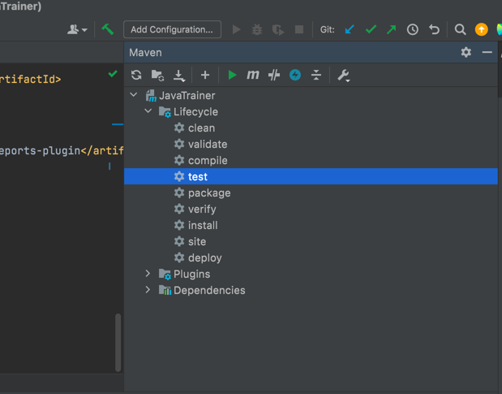

Create a new maven quick start project

first basic project

added testng dependency in maven
To run the test you can use maven lifecycle test or use command
  '''mvn test'''
in terminal 

03_add_restassured

Added class src/test/java/org/business/PostRequestExample.java
this demonstrates a simple main function
that uses rest assured to make a post call 

Right click the function and run as java application 